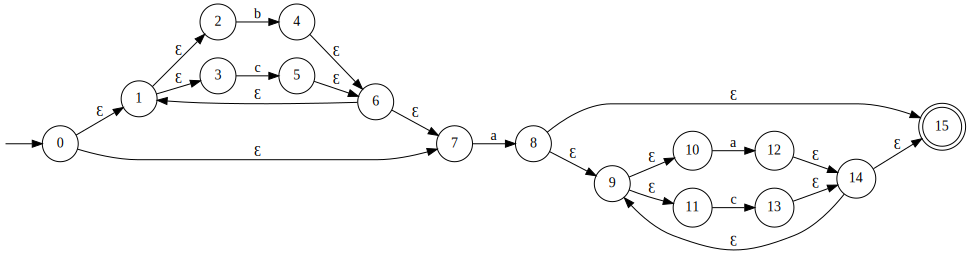
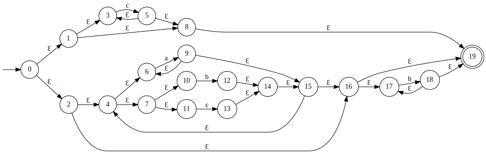
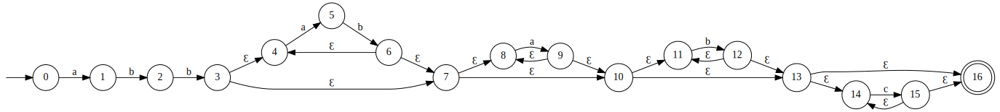
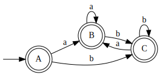
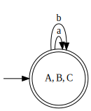

# Question 1 - Regular Expressions

1. `((a|b){2})*`
2. `b*a(b*ab*a)*b*`
3. `(a*ba*b)*a*`
4. `((^a(a|b)*b$)|(^b(a|b)*a$))`
5. `a?(ba?)*bb`
6. `0*(1(0|1){6,}|111(0|1){3}|1101(0|1){2})`
7. `(-?[1-9][0-9]*|0)[a-zA-Z]+([4-9]|[1-3][0-9]|4[0-4])`

# Question 2 - Non-Deterministic Finite Automata

a) `(b|c)*a(a|c)*`



b) `c*|(a+|(b|c))*b*`



\newpage

c) `abb(ab)*(a*b*c*)`



# Question 3 – NFA to DFA Conversion

a)

Table: Transition reference

|     | \ a             | \ b             | Ɛ*                          |
| --- | --------------- | --------------- | --------------------------- |
| \ 0 | \ $\varnothing$ | \ $\varnothing$ | $\{0,1,2,3,4,5,8,9,10,11\}$ |
| \ 1 | \ $\varnothing$ | \ $\varnothing$ | $\{1,2,3,4,5,8,9,10,11\}$   |
| \ 2 | \ $\varnothing$ | \ $\varnothing$ | $\{1,2,3,4,5,8,9,10,11\}$   |
| \ 3 | \ $\varnothing$ | \ $\varnothing$ | $\{1,2,3,4,5,8,9,10,11\}$   |
| \ 4 | $\{6\}$         | \ $\varnothing$ | $\{4\}$                     |
| \ 5 | \ $\varnothing$ | $\{7\}$         | $\{5\}$                     |
| \ 6 | \ $\varnothing$ | \ $\varnothing$ | $\{1,2,3,4,5,6,8,9,10,11\}$ |
| \ 7 | \ $\varnothing$ | \ $\varnothing$ | $\{1,2,3,4,5,7,8,9,10,11\}$ |
| \ 8 | \ $\varnothing$ | \ $\varnothing$ | $\{1,2,3,4,5,8,9,10,11\}$   |
| \ 9 | \ $\varnothing$ | \ $\varnothing$ | $\{1,2,3,4,5,8,9,10,11\}$   |
| 10  | \ $\varnothing$ | \ $\varnothing$ | $\{1,2,3,4,5,8,9,10,11\}$   |
| 11  | \ $\varnothing$ | \ $\varnothing$ | $\{11\}$                    |

Table: DStates

|     |                             |
| --- | --------------------------- |
| A   | $\{0,1,2,3,4,5,8,9,10,11\}$ |
| B   | $\{1,2,3,4,5,6,8,9,10,11\}$ |
| C   | $\{1,2,3,4,5,7,8,9,10,11\}$ |

Table: Ɛ-closure state pairings

|                |     |
| -------------- | --- |
| Ɛ-closure({0}) | A   |
| Ɛ-closure({6}) | B   |
| Ɛ-closure({7}) | C   |

\newpage

**Subset construction algorithm**

```
T = Ɛ-closure(0) = { 0, 1, 2, 3, 4, 5, 8, 9, 10, 11 } = A
U = Ɛ-closure(moveTo(A, a))
U = Ɛ-closure({ 6 }) = { 1, 2, 3, 4, 5, 6, 8, 9, 10, 11 } = B
U = Ɛ-closure(moveTo(A, b))
U = Ɛ-closure({ 7 }) = { 1, 2, 3, 4, 5, 7, 8, 9, 10, 11 } = C

T = B
U = Ɛ-closure(moveTo(B, a))
U = Ɛ-closure({ 6 }) = B
U = Ɛ-closure(moveTo(B, b))
U = Ɛ-closure({ 7 }) = C

T = C
U = Ɛ-closure(moveTo(C, a))
U = Ɛ-closure({ 6 }) = B
U = Ɛ-closure(moveTo(C, b))
U = Ɛ-closure({ 7 }) = C
```

Table: Resulting NFA transitions

|                           | a   | b   |
| ------------------------- | --- | --- |
| $\rightarrow$ \circled{A} | B   | C   |
| \ \ \ \ \circled{B}       | B   | C   |
| \ \ \ \ \circled{C}       | B   | C   |




