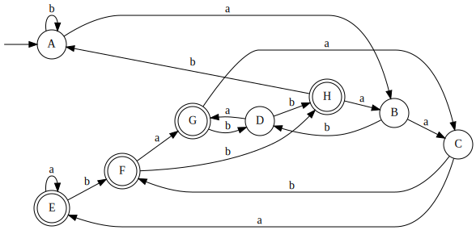

# Question 1 - Regular Expressions

1. `((a|b){2})*`
2. `b*a(b*ab*a)*b*`
3. `(a*ba*b)*a*`
4. `((^a(a|b)*b$)|(^b(a|b)*a$))`
5. `(a?b)+b`
6. `0*(1(0|1){6,}|111(0|1){3}|1101(0|1){2})`
7. `(-?[1-9][0-9]*|0)[a-zA-Z]+([4-9]|[1-3][0-9]|4[0-4])`

# Question 2 - Non-Deterministic Finite Automata

a) `(b|c)*a(a|c)*`


b) `c*|(a+|(b|c))*b*`


\newpage

c) `abb(ab)*(a*b*c*)`


# Question 3 – NFA to DFA Conversion

a)

Table: NFA transition function reference

| State        | \ a             | \ b             | \ Ɛ*                        |
| ------------ | --------------- | --------------- | --------------------------- |
| \ 0          | \ $\varnothing$ | \ $\varnothing$ | $\{0,1,2,3,4,5,8,9,10,11\}$ |
| \ 1          | \ $\varnothing$ | \ $\varnothing$ | $\{1,2,3,4,5,8,9,10,11\}$   |
| \ 2          | \ $\varnothing$ | \ $\varnothing$ | $\{1,2,3,4,5,8,9,10,11\}$   |
| \ 3          | \ $\varnothing$ | \ $\varnothing$ | $\{1,2,3,4,5,8,9,10,11\}$   |
| \ 4          | $\{6\}$         | \ $\varnothing$ | $\{4\}$                     |
| \ 5          | \ $\varnothing$ | $\{7\}$         | $\{5\}$                     |
| \ 6          | \ $\varnothing$ | \ $\varnothing$ | $\{1,2,3,4,5,6,8,9,10,11\}$ |
| \ 7          | \ $\varnothing$ | \ $\varnothing$ | $\{1,2,3,4,5,7,8,9,10,11\}$ |
| \ 8          | \ $\varnothing$ | \ $\varnothing$ | $\{1,2,3,4,5,8,9,10,11\}$   |
| \ 9          | \ $\varnothing$ | \ $\varnothing$ | $\{1,2,3,4,5,8,9,10,11\}$   |
| 10           | \ $\varnothing$ | \ $\varnothing$ | $\{1,2,3,4,5,8,9,10,11\}$   |
| \circled{11} | \ $\varnothing$ | \ $\varnothing$ | $\{11\}$                    |

Table: DStates

|             |                             |
| ----------- | --------------------------- |
| \circled{A} | $\{0,1,2,3,4,5,8,9,10,11\}$ |
| \circled{B} | $\{1,2,3,4,5,6,8,9,10,11\}$ |
| \circled{C} | $\{1,2,3,4,5,7,8,9,10,11\}$ |

Table: Ɛ-closure state pairings

|                    |             |
| ------------------ | ----------- |
| Ɛ-closure($\{0\}$) | \circled{A} |
| Ɛ-closure($\{6\}$) | \circled{B} |
| Ɛ-closure($\{7\}$) | \circled{C} |

\newpage

**Subset construction algorithm**

```
T = Ɛ-closure(0) = { 0, 1, 2, 3, 4, 5, 8, 9, 10, 11 } = A
U = Ɛ-closure(moveTo(A, a))
U = Ɛ-closure({ 6 }) = { 1, 2, 3, 4, 5, 6, 8, 9, 10, 11 } = B
U = Ɛ-closure(moveTo(A, b))
U = Ɛ-closure({ 7 }) = { 1, 2, 3, 4, 5, 7, 8, 9, 10, 11 } = C

T = B
U = Ɛ-closure(moveTo(B, a))
U = Ɛ-closure({ 6 }) = B
U = Ɛ-closure(moveTo(B, b))
U = Ɛ-closure({ 7 }) = C

T = C
U = Ɛ-closure(moveTo(C, a))
U = Ɛ-closure({ 6 }) = B
U = Ɛ-closure(moveTo(C, b))
U = Ɛ-closure({ 7 }) = C
```

Table: Resulting DFA transition function

|                           | a   | b   |
| ------------------------- | --- | --- |
| $\rightarrow$ \circled{A} | B   | C   |
| \ \ \ \ \circled{B}       | B   | C   |
| \ \ \ \ \circled{C}       | B   | C   |


\newpage

b)

Table: NFA transition function reference

| State       | \ a             | \ b             | \ Ɛ*    |
| ----------- | --------------- | --------------- | ------- |
| \ 0         | $\{0,1\}$       | $\{0\}$         | $\{0\}$ |
| \ 1         | $\{2\}$         | $\{2\}$         | $\{1\}$ |
| \ 2         | $\{3\}$         | $\{3\}$         | $\{2\}$ |
| \circled{3} | \ $\varnothing$ | \ $\varnothing$ | $\{3\}$ |

Table: DStates

|             |               |
| ----------- | ------------- |
| \ A         | $\{0\}$       |
| \ B         | $\{0,1\}$     |
| \ C         | $\{0,1,2\}$   |
| \ D         | $\{0,2\}$     |
| \circled{E} | $\{0,1,2,3\}$ |
| \circled{F} | $\{0,2,3\}$   |
| \circled{G} | $\{0,1,3\}$   |
| \circled{H} | $\{0,3\}$     |

Table: Ɛ-closure state pairings

|                          |             |
| ------------------------ | ----------- |
| Ɛ-closure($\{0\}$)       | \ A         |
| Ɛ-closure($\{0,1\}$)     | \ B         |
| Ɛ-closure($\{0,1,2\}$)   | \ C         |
| Ɛ-closure($\{0,2\}$)     | \ D         |
| Ɛ-closure($\{0,1,2,3\}$) | \circled{E} |
| Ɛ-closure($\{0,2,3\}$)   | \circled{F} |
| Ɛ-closure($\{0,1,3\}$)   | \circled{G} |
| Ɛ-closure($\{0,3\}$)     | \circled{H} |

\newpage

**Subset construction algorithm**

```
T = Ɛ-closure(0) = { 0 } = A
U = Ɛ-closure(moveTo(A, a))
U = Ɛ-closure({ 0, 1 }) = { 0, 1 } = B
U = Ɛ-closure(moveTo(A, b))
U = Ɛ-closure({ 0 }) = A

T = B
U = Ɛ-closure(moveTo(B, a))
U = Ɛ-closure({ 0, 1, 2 }) = { 0, 1, 2 } = C
U = Ɛ-closure(moveTo(B, b))
U = Ɛ-closure({ 0, 2 }) = { 0, 2 } = D

T = C
U = Ɛ-closure(moveTo(C, a))
U = Ɛ-closure({ 0, 1, 2, 3 }) = { 0, 1, 2, 3 } = E
U = Ɛ-closure(moveTo(C, b))
U = Ɛ-closure({ 0, 2, 3 }) = { 0, 2, 3 } = F

T = D
U = Ɛ-closure(moveTo(D, a))
U = Ɛ-closure({ 0, 1, 3 }) = { 0, 1, 3 } = G
U = Ɛ-closure(moveTo(D, b))
U = Ɛ-closure({ 0, 3 }) = { 0, 3 } = H

T = E
U = Ɛ-closure(moveTo(E, a))
U = Ɛ-closure({ 0, 1, 2, 3 }) = E
U = Ɛ-closure(moveTo(E, b))
U = Ɛ-closure({ 0, 2, 3 }) = F

T = F
U = Ɛ-closure(moveTo(F, a))
U = Ɛ-closure({ 0, 1, 3 }) = G
U = Ɛ-closure(moveTo(F, b))
U = Ɛ-closure({ 0, 3 }) = H

T = G
U = Ɛ-closure(moveTo(G, a))
U = Ɛ-closure({ 0, 1, 2 }) = C
U = Ɛ-closure(moveTo(G, b))
U = Ɛ-closure({ 0, 2 }) = D

T = H
U = Ɛ-closure(moveTo(H, a))
U = Ɛ-closure({ 0, 1 }) = B
U = Ɛ-closure(moveTo(H, b))
U = Ɛ-closure({ 0 }) = A
```

\newpage

Table: Resulting DFA transition function

|                   | a   | b   |
| ----------------- | --- | --- |
| $\rightarrow$ A   | B   | A   |
| \ \ \ \ B         | C   | D   |
| \ \ \ \ C         | E   | F   |
| \ \ \ \ D         | G   | H   |
| \ \ \ \circled{E} | E   | F   |
| \ \ \ \circled{F} | G   | H   |
| \ \ \ \circled{G} | C   | D   |
| \ \ \ \circled{H} | B   | A   |


